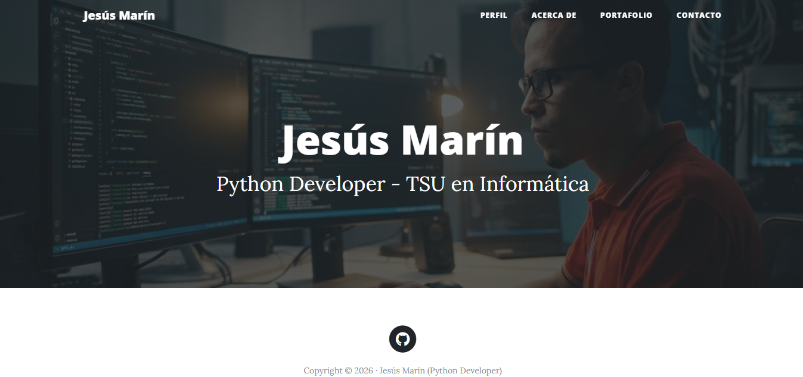
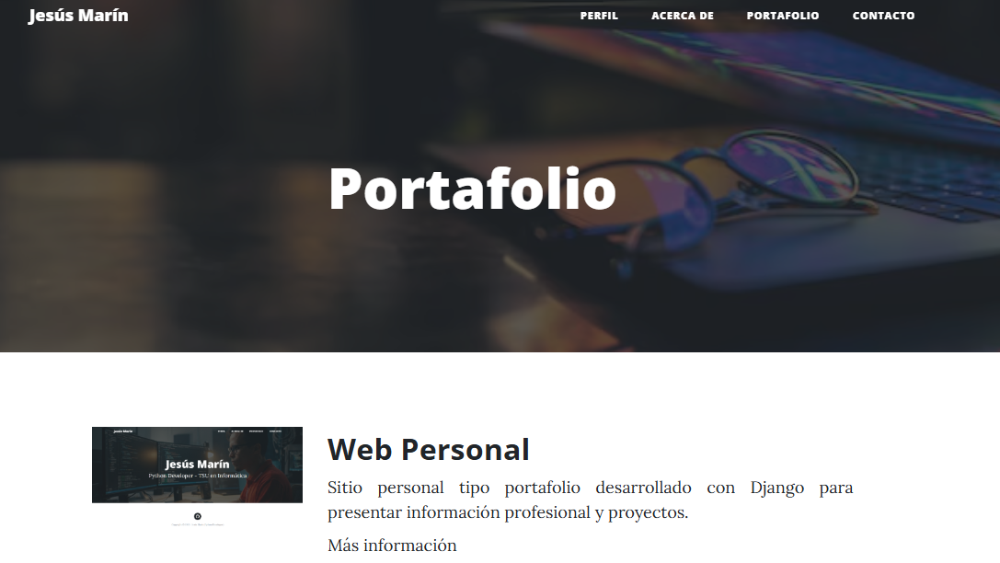
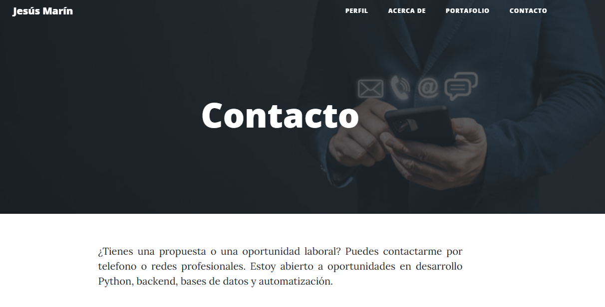
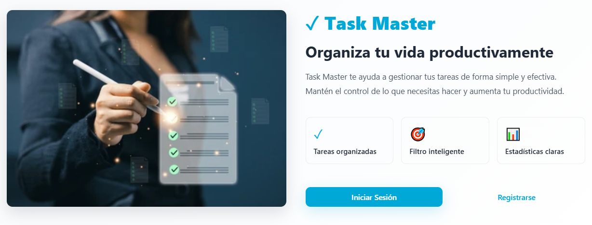

# Web Personal - Jesus Marin

Portafolio web personal construido con Django 6.0.5. Incluye página de perfil, sección acerca de mi, galería de proyectos y página de contacto.

## Estructura del proyecto

Dos aplicaciones Django:

- **core** -- Paginas estaticas: inicio, acerca de y contacto. Sin modelos, solo vistas que renderizan templates.
- **portfolio** -- Gestion de proyectos. Incluye el modelo `Project` con titulo, descripcion, imagen, link opcional y marcas de tiempo. Los proyectos se ordenan del mas reciente al mas antiguo y se administran desde el panel de Django admin.

Los templates usan Bootstrap 4, Font Awesome 4 y un tema Clean Blog. El layout base esta en `base.html` con bloques para titulo, imagen de fondo, encabezados y contenido que cada pagina extiende.

## Requisitos

- Python 3.10+
- Django 6.0.5
- MySQL (probado en 8.x)
- Pillow (para subida de imagenes)
- mysqlclient (o PyMySQL como alternativa)

Debe existir una base de datos MySQL llamada `webpersonaldb`. La conexion por defecto apunta a `127.0.0.1:3306` con usuario `root`.

## Instalacion

```bash
# Crear y activar un entorno virtual
python -m venv venv
venv\Scripts\activate   # Windows
# source venv/bin/activate   # Linux / macOS

# Instalar dependencias
pip install -r requirements.txt

# Configurar la conexion a la base de datos en webpersonal/settings.py
# si tus credenciales de MySQL son distintas a las que vienen por defecto.

# Crear la base de datos
mysql -u root -p -e "CREATE DATABASE webpersonaldb CHARACTER SET utf8mb4;"

# Ejecutar migraciones
python manage.py migrate

# Crear un superusuario para el panel de administracion
python manage.py createsuperuser

# Iniciar el servidor de desarrollo
python manage.py runserver
```

El sitio estara disponible en `http://127.0.0.1:8000/`.

## Configuracion

Todos los ajustes estan en `webpersonal/settings.py`:

| Ajuste | Valor por defecto |
|---|---|
| `DEBUG` | `True` |
| `LANGUAGE_CODE` | `es` |
| `TIME_ZONE` | `UTC` |
| `DATABASES` | MySQL, `webpersonaldb` |
| `MEDIA_ROOT` | `BASE_DIR / media` |
| `ALLOWED_HOSTS` | `127.0.0.1`, `localhost`, IPs locales |

Antes de desplegar, cambiar `DEBUG = False` y actualizar `ALLOWED_HOSTS`.

## Paginas

| URL | Vista | Descripcion |
|---|---|---|
| `/` | `core.views.home` | Pagina de inicio con resumen del perfil |
| `/about-me/` | `core.views.about` | Biografia y antecedentes |
| `/portfolio/` | `portfolio.views.portfolio` | Galeria de proyectos con imagenes y descripciones |
| `/contact/` | `core.views.contact` | Informacion de contacto |
| `/admin/` | Admin de Django | Gestion de proyectos y usuarios |

## Administrar proyectos

Ingresar a `/admin/` con la cuenta de superusuario. El modelo Project tiene estos campos:

- **Titulo** -- obligatorio, maximo 200 caracteres
- **Descripcion del Proyecto** -- texto largo
- **Imagen** -- se sube a `media/projects/`
- **Link de GitHub** -- opcional, campo URL
- **Fecha de Creacion** -- se asigna automaticamente, solo lectura en admin
- **Fecha de Modificacion** -- se asigna automaticamente, solo lectura en admin

## Licencia

Proyecto personal. Sin licencia especificada.

## Vista de Web Personal

### Pagina de perfil



### Portafolio de proyectos



### Pagina de contacto



### Vista de proyecto individual (TaskMaster)


